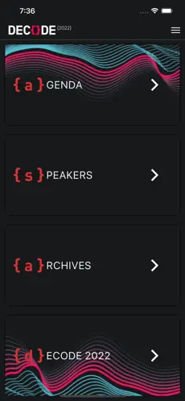
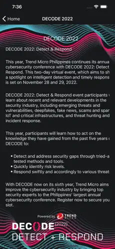
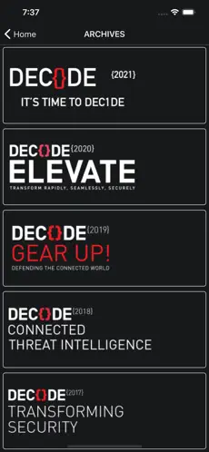
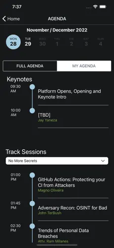
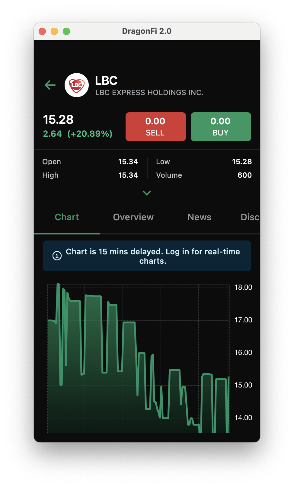
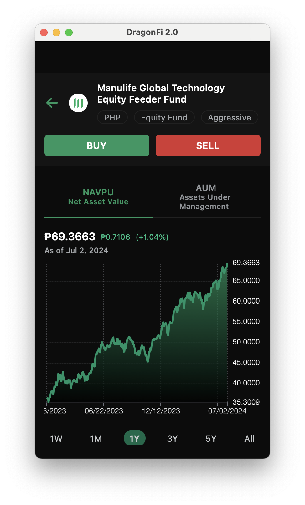
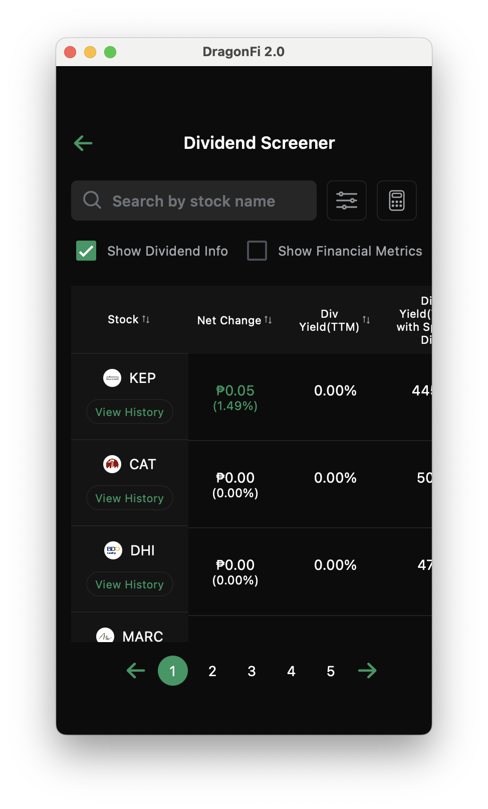
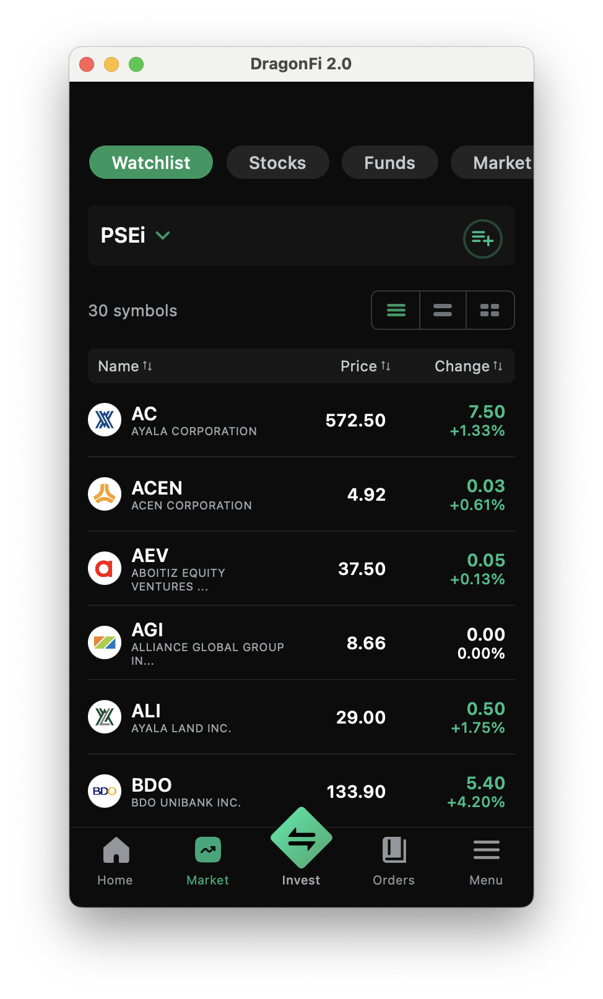
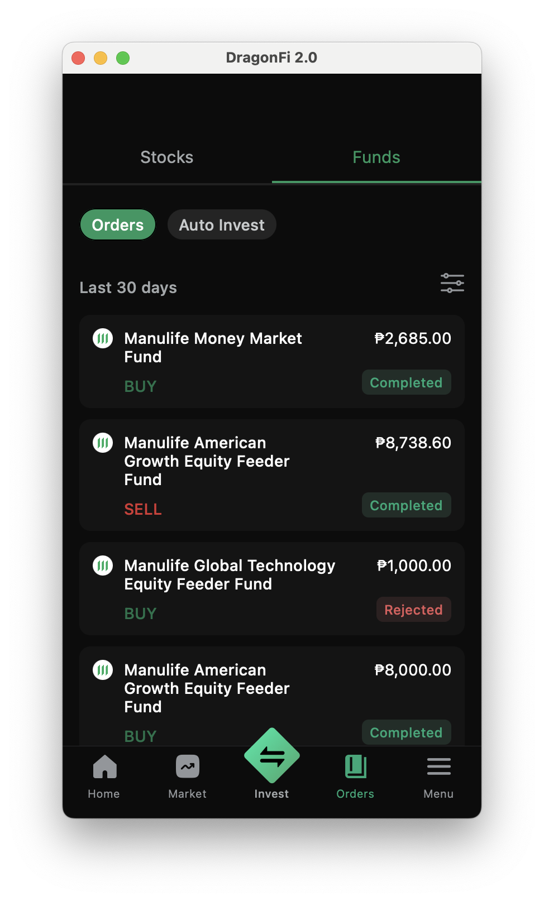
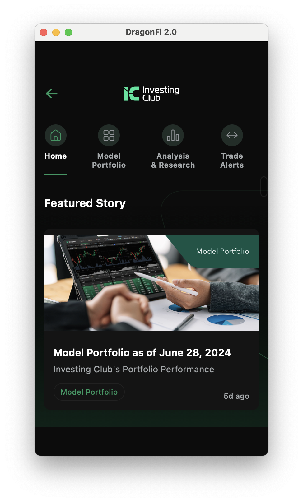

# My Portfolio
The following projects that I've handled since I started writing in Swift, Kotlin and React Native

### Japan Railway POC (2019)

##### Description: An application that monitors user's Credit Card usage and activities. 

##### Responsible for code development using RxSwift and Unit Testing.

##### Technologies: Native iOS, MVVM, RxSwift, RxCocoa Cocoapods, Github, REST API, GoogleMaps

##### Location: Tokyo, Japan

##### Link: --

  
   
  
  

### DermoPico Hair (2020)

##### Description: An application detect hair impurities and suggest products based on company's algorithm. 

##### Responsible for code development using RxSwift and Unit Testing.

##### Technologies: Native iOS, MVVM, RxSwift, RxCocoa Cocoapods, Github, REST API, GoogleMaps

##### Location: Seoul, South Korea

##### Link: https://apps.apple.com/us/app/dermopico-hair/id1270671201

  
  
  

### DermoPico Skin (2020)

##### Description: An application detect skin impurities and suggest products based on company's algorithm. 

##### Responsible for code development using RxSwift and Unit Testing.

##### Technologies: Native iOS, MVVM, RxSwift, RxCocoa Cocoapods, Github, REST API, GoogleMaps

##### Location: Seoul, South Korea

##### Link: https://apps.apple.com/us/app/dermopico-hair/id1270671201

  
  
  

### On boarding App (2019 - 2021)

##### Description: A digital onboarding application for new hires in the company. It uses digital forms, tax declarations and personal info.

##### Responsible for leading code development, bug fixes, code reviewer for iOS Technology on the team. Coordinate with apple team to upload iOS application to AppStore. Perform production support on iOS Platform of the project. Making sure Provisioning Profiles, Certificates and Identifiers are up-to-date.

##### Technologies: Native iOS, MVC, Swift 4.2, Cocoapods, Alamofire, Github, Apple Push Notifications

##### Location: Australia, New Zealand

##### Link: https://play.google.com/store/apps/details?id=com.dxc.obm.obm_android&hl=en_SG&pli=1 , https://apps.apple.com/au/app/dxc-onboard-me/id1513544909 

  
   
  
  

### Mobile Streaming 2022

##### Programming Language: React-Native, AWS (S3, Lambda Function, API Gateway, Cloudfront, IAM, Cloudwatch, Microsoft SQL).
##### Technologies Used: SonarQube and K6 for Security and Performance Testing.

##### Role: Full-Stack Engineer (Front-end, Back-end, UI/UX, Product Owner, Tester)
##### Team of 2 Developers.

##### Description: A learning video-streaming platform for employees.

##### Responsible for leading code development, architecture design, testing, provide technical documentation and featuresm design UI/UX, design API Endpoints, bug fixes, code reviewer and Perform performance and security testing.

##### Location: Manila

  
   
  
  
  
  

### Cybersecurity Conference App

##### Programming Language: React-Native, AWS (S3, Lambda Function, API Gateway, Cloudfront, IAM, Cloudwatch, Microsoft SQL).
##### Technologies Used: SonarQube and K6 for Security and Performance Testing.

##### Role: Full-Stack Engineer (Front-end, Back-end, UI/UX, Product Owner, Tester)
##### Team of 1 Developers.

##### Description: An annual cybersecurity conference event.

##### Responsible for leading code development, architecture design, testing, provide technical documentation and featuresm design UI/UX, design API Endpoints, bug fixes, code reviewer and Perform performance and security testing.

##### Location: Manila
#### Link: https://apps.apple.com/ph/app/decode-mobile/id1592037312

  
  
  
  

### Seaplane Group Mobile - 2023

##### Programming Language: React-Native
##### Technologies Used: Axios, Redux.

##### Role: Project Manager / Developer
##### Team of 1 Developer.

##### Description: A booking app for affordable luxury rides and ride-sharing.

##### Responsible for leading code development, architecture design, testing, provide technical documentation and featuresm design UI/UX, design API Endpoints, bug fixes, code reviewer and Perform performance and security testing.

##### Location: Hong Kong

#### Link: https://apps.apple.com/ph/app/seaplane-mobile/id1639533976

  
   
  

### DragonFi 2.0 - Stocks and Funds Group Mobile - 2024

##### Programming Language: React-Native
##### Technologies Used: Axios, Zustand, Expo, TypeScript, WebSockets.

##### Role: Developer
##### Team of 1 Developer.

##### Description: A booking app for Trading Stocks and Funds.

##### Responsible for leading code development, architecture design, testing, provide technical documentation and featuresm design UI/UX, design API Endpoints, bug fixes, code reviewer and Perform performance and security testing.

##### Location: Manila

#### Link: https://apps.apple.com/ph/app/dragonfi-2-0-stocks-funds/id6462978863)

  
   
  
  
  
  
  

